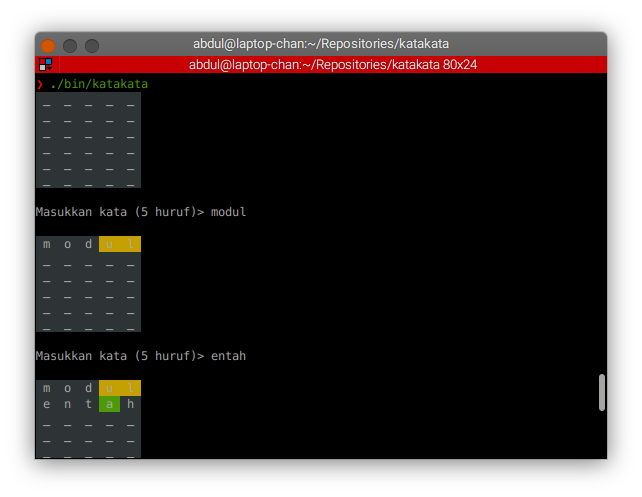

# Kata-kata - A Simple CLI Program of Indonesian Version of Wordle Written in C

I write this in my free time & just for fun. I think the code is very rough & the documentation is not that much because I'm doing a quick reimplementation of a simple wordle program & having fun after I know how to color the CLI text.

## Building & Installing

Just use the `GNU Make` & `GNU GCC` program

```sh
$ make all
$ sudo make install   # install into /usr/local/bin
$ sudo make uninstall # remove from /usr/local/bin
```

## Some Screenshots



[](https://kbbi.web.id/lalau)
